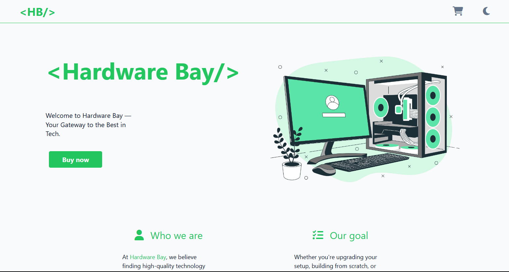
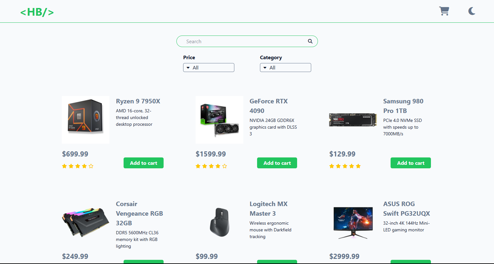

# Tailwind + Vite + Typescript

This project is an fictitious ecommerce app built for a random persona, with the main goal of improving my skills in Typescript and Tailwind.
Live at: https://hardware-bay.pages.dev

## Tech Stack

- Typescript
- Tailwind
- React
- Vite

Since this is a practice project and not a real production app, a local JSON file is used to mock a database.

## Features 

Besides being a rather simple application, it has some interesting scaling for multiple devices, a cart system and a theme toggling. 

## How to clone it

The app doesn't use any environmental variables, so it should be good to go once you install all dependencies. 

````
npm i
````

You can run by typing 
````
npm run dev
````
 in the terminal.
 
## UI

- **Home**:



- **Products**:


